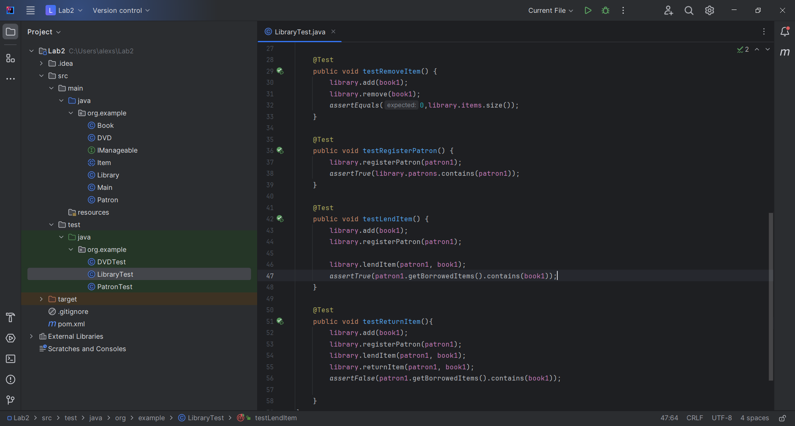

# JavaLearning
Лабораторна робота #2 Виконував: Щербаков Олексій ПД-34 Завдання:
1. Удосконаліть систему, яка дозволяє бібліотекареві керувати предметами (книгами, DVD) та клієнтами.

Система повинна мати можливість:

Додавати предмети (книги, DVD) до бібліотеки.
Видаляти предмети з бібліотеки.
Реєструвати читача.
Видавати предмет читачеві.
Повертати предмет у бібліотеку.
Показувати список доступних предметів.
Показувати список взятих предметів та їхніх читачів
2. Покрити тестами функціональність програми.
Хід розробки:
Згідно завдання і рекомендацій щодо опису класів і інтерфейсів була створена UML-діаграма з структурою програми

Всі класи і інтерфейси були зроблені згідно даних рекомендацій:
Item (Abstract Class)
Attributes:
title: String
uniqueID: String (unique for each item)
isBorrowed: boolean (default false)
Methods:
Constructors, getters, setters
abstract void borrowItem(): Makes the item as borrowed.
abstract void returnItem(): Marks the item as not borrowed.
Book (implements Item)
Attributes:
author: String
Methods:
borrowItem(): Implements the abstract method from Item.
returnItem(): Implements the abstract method from Item.
DVD (implements Item)
Attributes:
duration: int (minutes)
Methods:
borrowItem(): Implements the abstract method from Item.
returnItem(): Implements the abstract method from Item.
Patron
Attributes:
name: String
ID: String (unique for each patron)
borrowedItems: List<Item>
Methods:
Constructors, getters, setters
borrow(Item): Adds an item to the patron's borrowed list.
return(Item): Removes an item from the patron's borrowed list.
IManageable (Interface)
Methods:
add(Item): Adds an item.
remove(Item): Removes an item.
listAvailable(): Lists all available items.
listBorrowed(): Lists all borrowed items.
Library (implements IManageable)
Attributes:
items: List<Item> (to store all items)
patrons: List<Patron> (to store all registered patrons)
Methods:
registerPatron(Patron): Registers a new patron.
lendItem(Patron, Item): Lends an item to a patron.
returnItem(Patron, Item): Returns a borrowed item.

В класі Main, створені в інших класах методи, використали для наочного тестування всього функціоналу

Після цього в папці test створили тести для функціоналу класів Patron, DVD, Library.Дані тести ,створені за
допомогою Junit, покривають всю функціональність програми.

