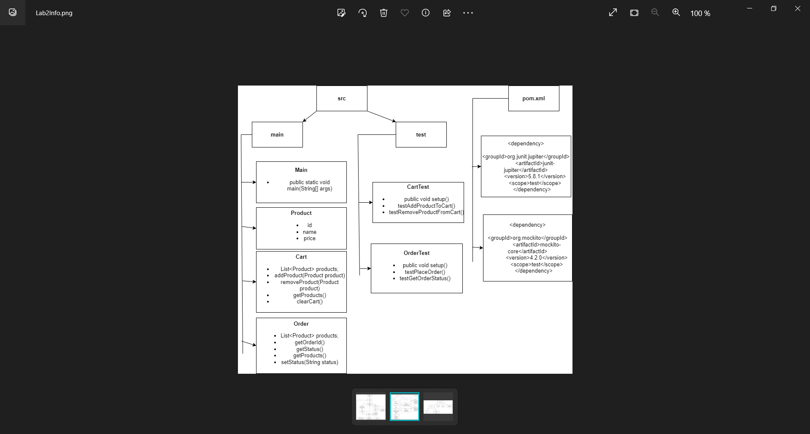
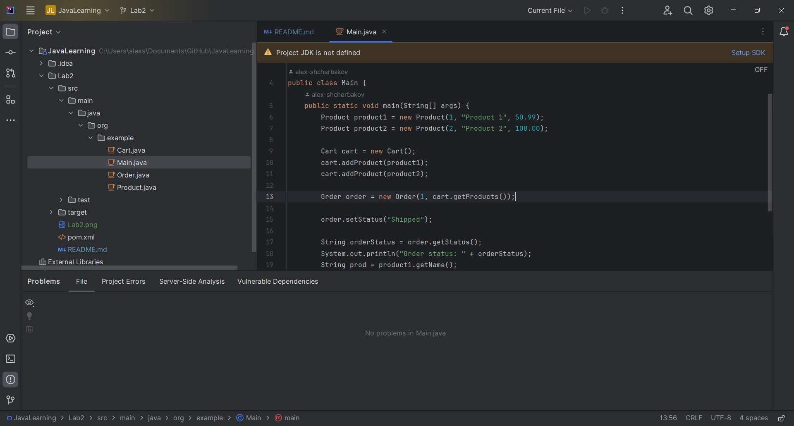
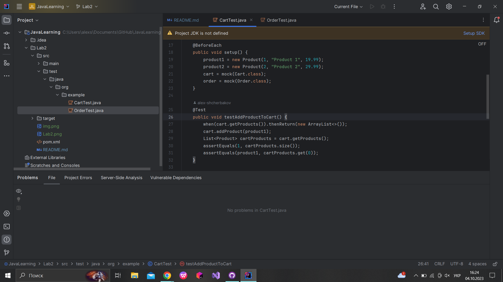

# JavaLearning
Лабораторна робота #3 Виконував: Щербаков Олексій ПД-34 Завдання:
Створіть базову систему електронної комерції, яка складається з сутностей Product, Cart та Order. Система повинна дозволяти користувачам:

Додавати продукти до кошика.

Видаляти продукти з кошика.

Робити замовлення з товарів у кошику.

Перевіряти статус замовлення.
Вимоги:

1. Сутності:

`Product`: Повинен мати атрибути, такі як `id`, `name`, `price` .

`Cart`: Повинен зберігати список продуктів.

`Order`: Повинен мати атрибути, такі як `orderId`, `products`, `status`.

2. Функціональність:
   Додати/видалити продукт з кошика.

Робити замовлення з товарів у кошику.

Отримувати статус конкретного замовлення.

3.  Тестування JUnit:
    Протестуйте, чи продукти додаються/видаляються правильно з кошика.

Протестуйте функціональність розміщення замовлення.

Протестуйте функціональність отримання статусу замовлення.

Після реалізації системи електронної комерції:
Напишіть тестові випадки JUnit для тестування всіх функцій.

Замокайте поведінку методів 

Хід розробки: Згідно з умовами завдання і вимогами до програми була створена діаграма на якій
показані основні класи, методи і властивості.

В класі Product описали властивості id,name,price.Клас Cart вмістив в себе список products і декілька методів для
додавання,видалення і показу продуктів у кошику.Метод clearCart повністю очищує список products(хоча цей метод я
майже не використовував).
Клас Order теж має список products і властивості status i orderId.Методи в цьому класі відповідають за отримання
Id певного продукту, встановлення і показ статусу замовлення.
В класі Main були створені два екземпляри Product і по одному екземпляру Cart i Order.І використовувалися 
декілька методів з інших класів.

Потім у папці test створили тестові випадки для методів класів Cart i Order.В них тестувалася 
функціональність розміщення замовлення,отримання статусу замовлення,додавання і видалення продуктів з кошику.
Ці тести були створені за допомогою фреймворку Mockito.Перед тестами були створені моковані об'єкти для класів
Cart i Order,за допомогою ключового слова mock.В самих же тестах була використана структура when().thenReturn();

