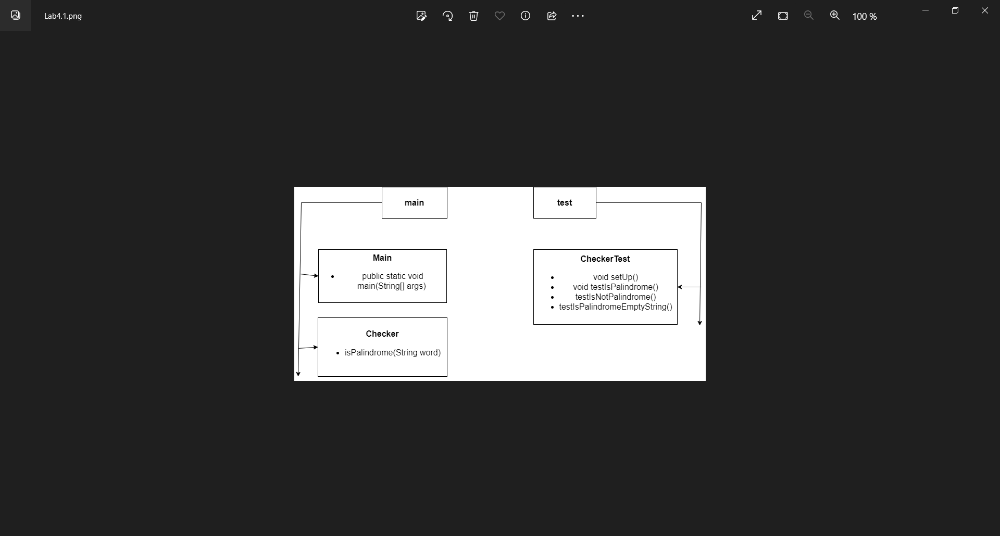
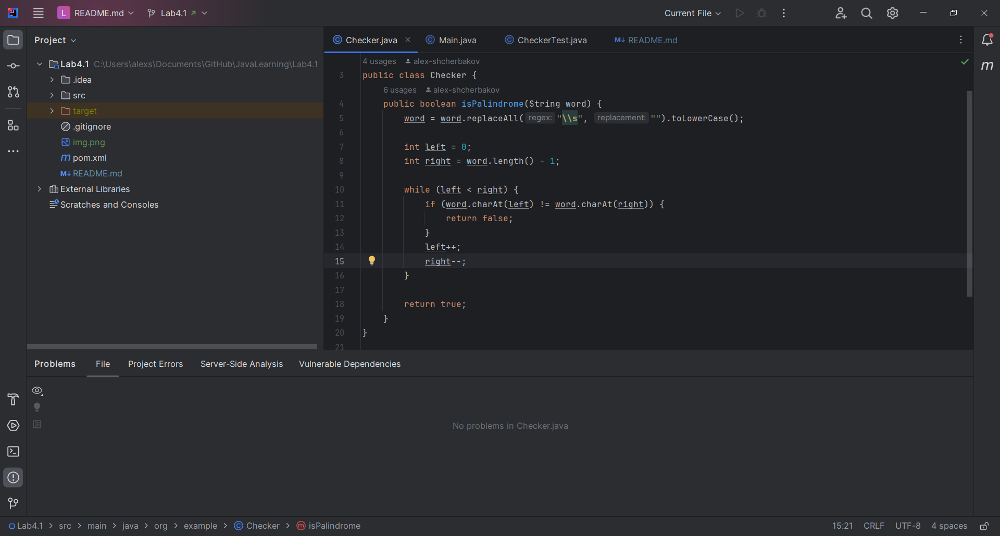
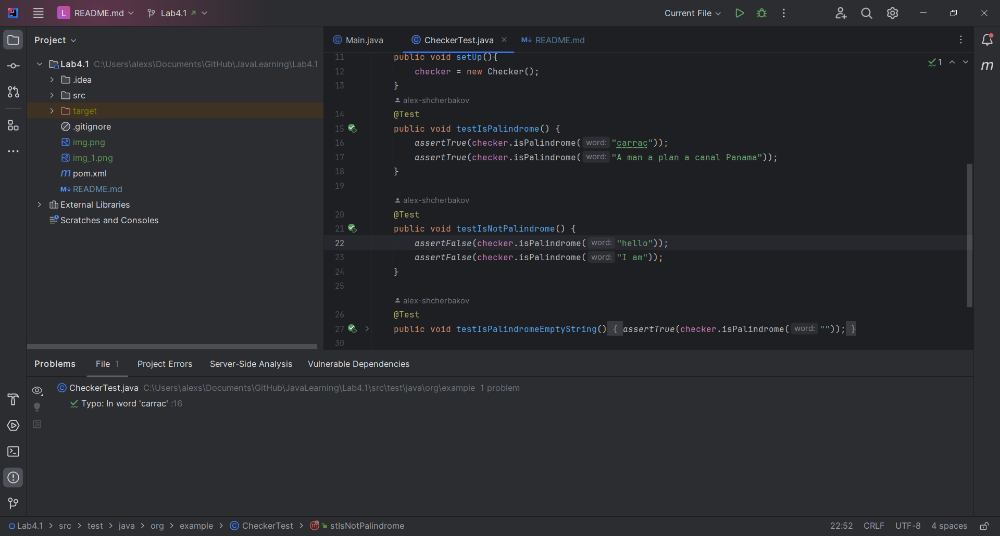

# JavaLearning
Лабораторна робота №4.1 Виконував: Щербаков Олексій ПД-34 Завдання:
1. Завдання
Реалізуйте функцію, яка перевіряє, чи дане слово є паліндромом (читається так само, як назад, так і вперед),
використовуючи рядки Java. Не забувайте ігнорувати регістр і пробіли!

2. Покрити тестами функціональність програми.

Хід розробки:
Згідно завдання була розроблена UML-діаграма з визначенням структури проекту

Клас Checker має лише одну функцію, яка перевіряє чи є слово паліндромом.При цьому пробіли не враховуються
за допомогою метода replaceAll.

Клас Main просто працює з вже створеним Checker і його методом.
Функціональність програми перевіряється в CheckerTest.Перевіряються випадки з словами, які є паліндромами, які
не є паліндромами і випадок з пустою строкою.

