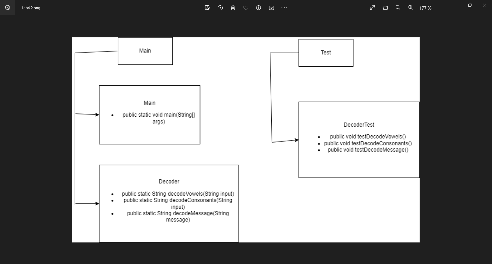
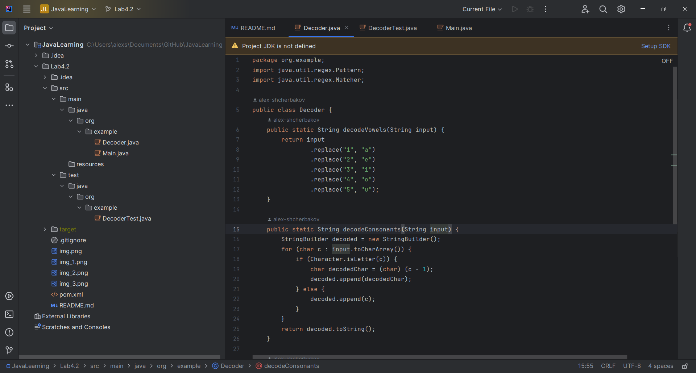
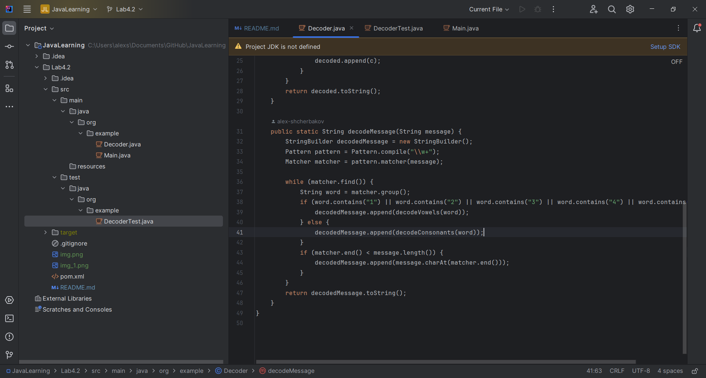
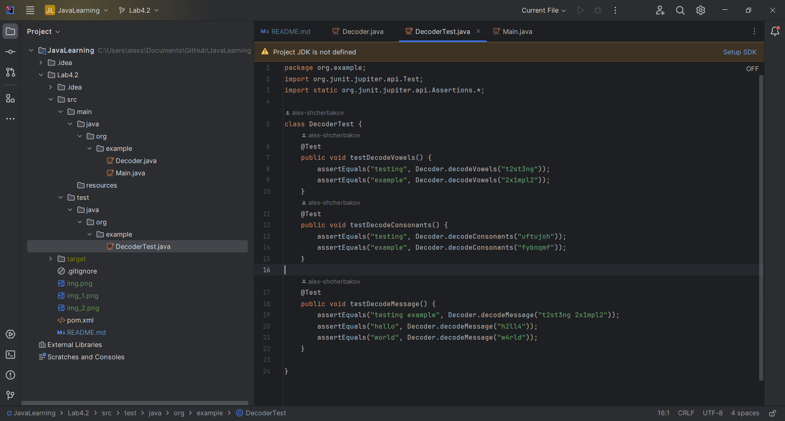

# JavaLearning
Лабораторна робота 4.2 (Hard) Виконував: Щербаков Олексій ПД-34

Мета:
Розуміти незмінну природу рядків Java.
Працювати з методами рядка Java та StringBuilder.
Розуміти регулярні вирази та їх застосування в Java.
Опис завдання:
У далекій галактиці існують повідомлення, зашифровані в дивних шаблонах, які потребують декодування. 
Вам було доручено написати програму на Java, яка розшифровує ці повідомлення.

Зашифроване повідомлення складається зі слів, розділених розділювачами, і кожне слово може бути закодовано різними
методами. Ваша програма повинна виявляти метод кодування та декодувати відповідно.

Методи кодування:
Кодування заміни голосних: усі голосні (a, e, i, o, u) замінюються на числа: a=1, e=2, i=3, o=4, u=5. Наприклад,
"t2st3ng" повинно бути "testing".
Кодування заміни приголосних: всі приголосні замінюються на наступний приголосний в послідовності. Наприклад, 
"ufttjoh" повинно бути "testing".

Вимоги:
Створіть клас Java Decoder зі статичними методами для кожного типу кодування.
Використовуйте регулярні вирази, щоб визначити, який метод кодування було застосовано до кожного слова.
Використовуйте StringBuilder для ефективних маніпуляцій з рядками.
Створіть функцію main для демонстрації вашого декодера з прикладами зашифрованих повідомлень.
Примітка: Це рішення припускає, що методи кодування не перетинаються. У реальному світі може знадобитися додаткові
методи для визначення типу кодування з більшою точністю.

2. Покрити тестами функціональність програми.

Хід розробки:
Була створена UML-діаграма, в якій описана структура програми, згідно до вимог

По-перше, був створений клас Decoder, в якому створив три функції.Перша функція decodeVowels для розшифровки 
першого методу кодування.За допомогою метода replace замінюємо цифри на голосні в отриманих словах.
Друга функція decodeConsonants для другого методу кодування.Створюється StringBuilder для маніпюляцій з рядками.
Рядок input після цього розбивається на масив символів і для кожного символу виконується перевірка чи є цей символ
літерою.Після цього цей символ або замінюється на попередній в алфавіті, або ж пропускається(в випадку пробілів).
За допомогою StringBuilder формуємо рядок з відповіддю.

І остання функція decodeMessage для декодування повідомлень з декількох слів, закодованих різними методами.
StringBuilder створюється для побудови рядка з відповіддю.За допомогою об'єктів Pattern і Matcher шукаємо в рядку
всі слова з цифр і букв,а також виділяємо окремі слова.У циклі while знайдені слова перевіряють на метод кодування
і розшифровуються згідно обраного методу.Нарешті, decodeMessege був використаний для створення фінального рядка.

У класі DecoderTest створюються тести для всіх трьох методів класу Decoder(У класі Main теж примір декодування).

