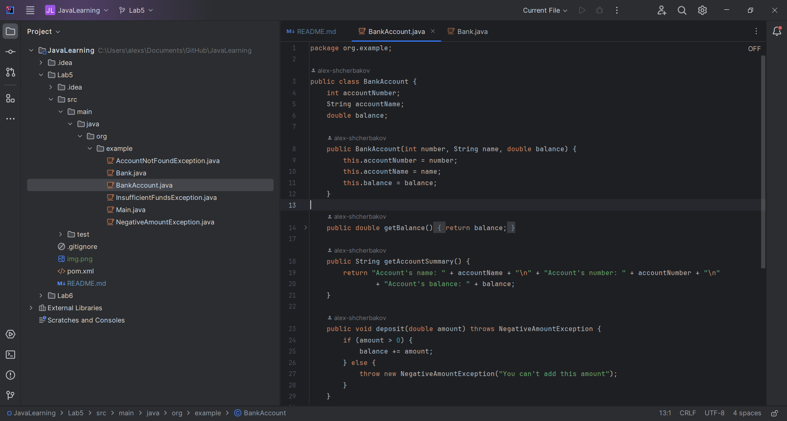
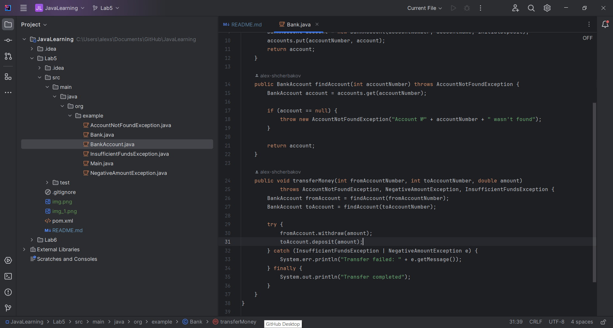

# JavaLearning
Лабораторна робота #5 Виконував: Щербаков Олексій ПД-34 Завдання: У цій лабораторній роботі вам потрібно 
реалізувати надійну і стійку до помилок програму, яка імітує спрощену банківську систему. 
Ця система буде включати створення рахунків, фінансові операції і функції зведення рахунків.
Ваше завдання полягає в тому, щоб переконатися, що програма може елегантно обробляти різні типи помилок, 
не ламаючись. Реалізуйте спеціалізовані класи винятків для обробки спеціалізованих сценаріїв помилок.

Хід розробки : 
Згідно з наступними етапами розробки:
Реалізуйте клас BankAccount з членами класу accountNumber, accountName і balance.
Реалізуйте методи deposit(double amount), withdraw(double amount), getBalance() та getAccountSummary().
Створіть спеціалізовані класи винятків:
InsufficientFundsException
NegativeAmountException
AccountNotFoundException
Реалізуйте клас Bank, який зберігає колекцію об'єктів BankAccount.
У класі Bank, реалізуйте методи:
createAccount(String accountName, double initialDeposit)
findAccount(int accountNumber)
transferMoney(int fromAccountNumber, int toAccountNumber, double amount)
Обробляйте винятки відповідно в кожному методі.
Створіть тестові класи, де ви моделюєте різні сценарії для тестування обробки виняткових ситуацій.

Була створена модель програми:

Спеціалізовані класи вийнятків були створені з полями і функціями, які повертають повідомлення про помилку.
Клас BankAccount був створений з полями accountNumber, accountName і balance.В ньому реалізували методи
deposit(double amount), withdraw(double amount), getBalance() та getAccountSummary().

Клас Bank зберігає колекцію об'єктів BankAccount за допомогою HashMap.І були додані методи createAccount
(String accountName, double initialDeposit) ,findAccount(int accountNumber), transferMoney
(int fromAccountNumber, int toAccountNumber, double amount).Кожен з яких приймає свої значення для роботи.

Крім того, у код цих класів були додані класи-вийнятки,які викликаються в залежності від певних умов.
Останнім завданням було створення тестових класів для перевірки функціоналу програми.
Клас BankTest перевіряє функціональність за допомогою структури try{}catch.

Клас BankAccountTest перевіряє методи відповідного класу більш звичайним шляхом, за допомогою Junit.

