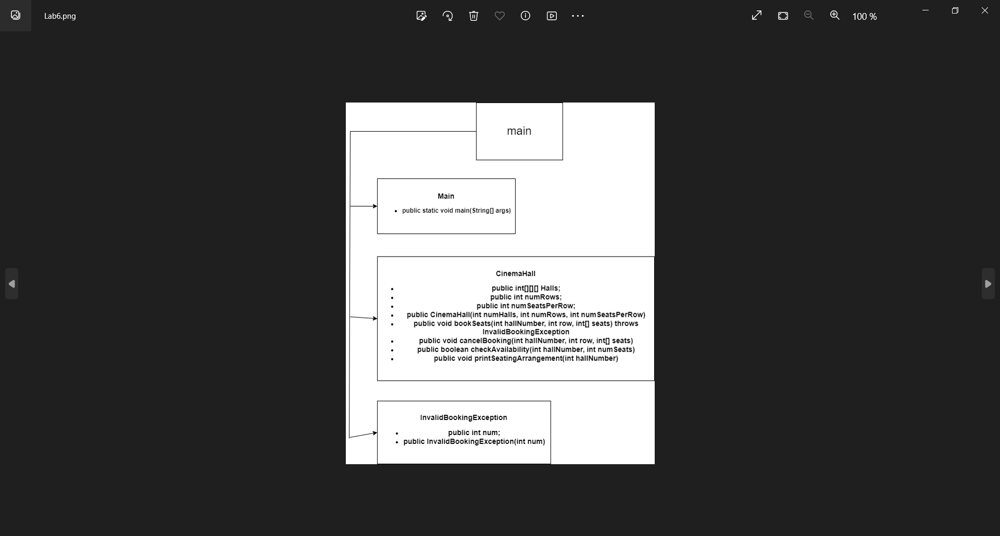
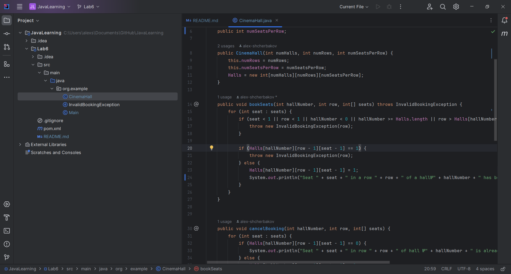
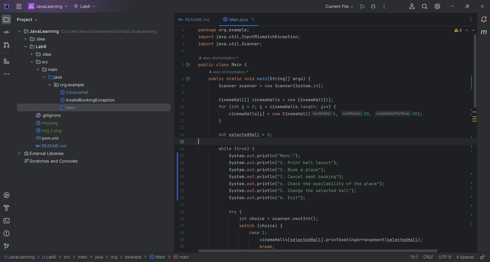
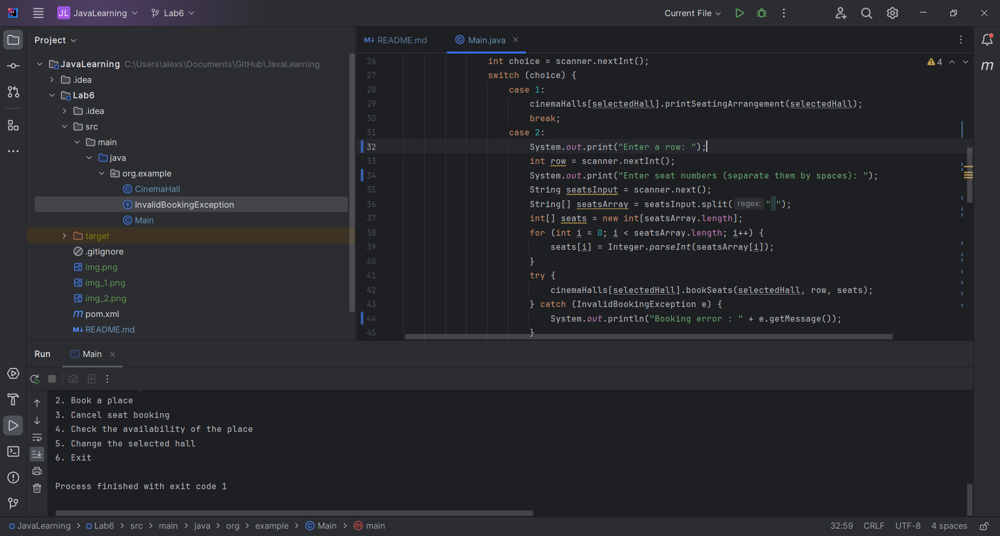

# JavaLearning
Звіт з лабараторної роботи №6, виконав: Щербаков Олексій ПД-34.
Завдання: Уявіть, що вам потрібно створити Java-додаток для кінотеатру. 
У кінотеатрі п'ять залі, кожен з яких має розміщення місць у 10 рядів та 20 місць.
Місця представлені 3D масивом, де перший вимір представляє зал, другий - ряд, а третій - місце.

Ініціалізація Масиву: Створіть 3D масив для представлення кінотеатру. Ініціалізуйте масив нулями, 
що вказує на те, що всі місця вільні.

Бронювання Місць: Напишіть метод bookSeats(int hallNumber, int row, int[] seats), який приймає номер залу,
номер ряду, номери місць для бронювання. Метод повинен позначити заброньовані місця, змінивши відповідні 
нулі на одиниці. Якщо місця заброньовані, система повинна сповістити про це користувача.

Скасування Бронювання: Напишіть метод cancelBooking(int hallNumber, int row, int[] seats), який скасовує
бронювання, змінюючи відповідні одиниці назад на нулі.

Перевірка Наявності: Напишіть метод checkAvailability(int screen, int numSeats), який перевіряє, чи доступна
задана кількість послідовних місць в будь-якому ряду зазначеного залу.

Друк Схеми Розміщення Місць: Напишіть метод printSeatingArrangement(int hallNumber), який друкує схему 
розміщення місць для даного залу, вказуючи заброньовані та доступні місця.

Хід роботи:
Спочатку була створена модель програми згідно заданих вимог:

По-перше, я створив клас CinemaHall, в якому реалізував всі методи:  bookSeats, cancelBooking, checkAvailability,
printSeatingArrangement.
По-друге, був створений спеціалізований клас вийняток, для випадків, коли намагаються забронювати місце в ряді,
якого не існує, або місце якого не існує.Або ж місце вже заброньоване.Цим вийнятком був допрацьований метод
bookseats.

Нарешті, весь функціонал був повноційно реалізований в класі main.В ньому спочатку був створений екземпляр
класу CinemaHall з заданими 5-и залами, 10-и рядами і 20-и місцями.
Потім через цикл while створили меню через яке буде проходити взаємодія з функціоналом.

Завдяки конструкції try{}catch{} проводиться перевірка чи вводиться в консоль ціле число чи ні.Сама ж перевірка
проводиться за допомогою InputMismatchException.

В середині try{} вставлена конструкція switch, де оброблюються всі вибори,які вводяться в консолі.У всіх 
6-и кейсах викликаються методи для відповідного функціоналу.У випадку другої опції, яка відповідає за
бронювання місць є перевірка чи можливо забронювати обране місце за допомогою класу InvalidBookingException.

