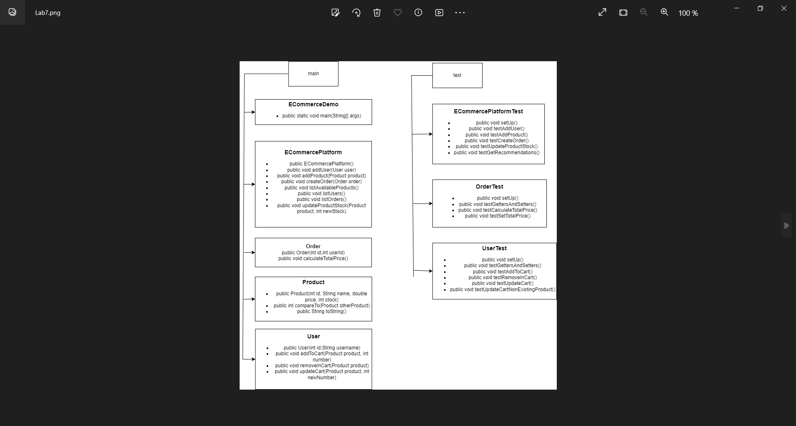
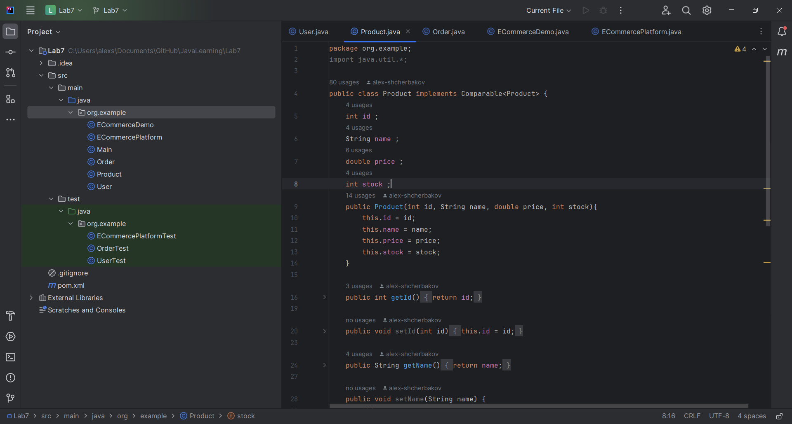
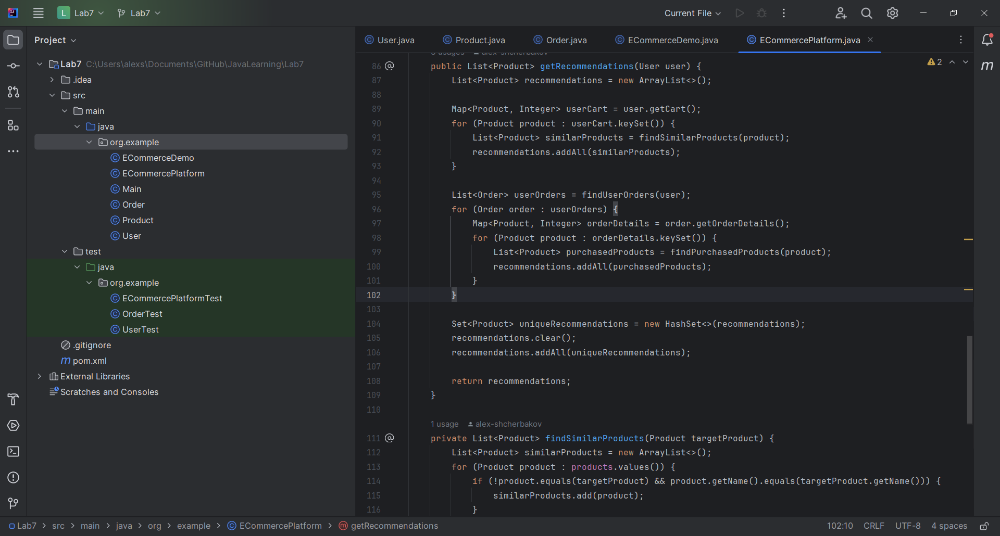
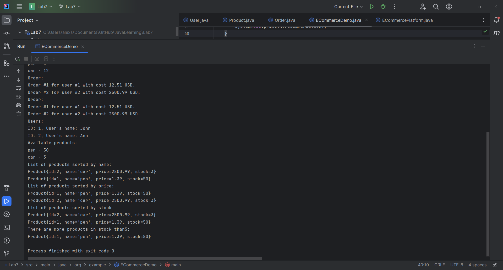
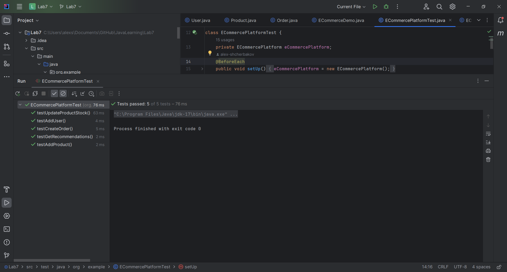

# JavaLearning
Лабораторна робота #7 Виконував: Щербаков Олексій ПД-34 Завдання:Необхідно реалізувати спрощену систему бек-енду
для платформи електронної комерції, використовуючи Java Collections, зосереджуючись на управлінні запасами,
управлінні корзиною користувача та обробці замовлень.

Хід роботи:
Згідно рекомендації до завдання була створена UML-діаграма, яка відображає всі створені у роботі класи і їх методи

У першій частині роботи, були створені основні класи User, Product i Order.З всіма полями і методами і встановленими
гетерами, сетерами.

У другій частині роботи, був створений клас ECommercePlatform, з полями типу Map<integer> для різних класів.
Всі методи реалізують необхідні функції: для додавання користувачів, товарів, створення замовлення,
переліку доступних товарів, переліку користувачів, переліку замовлень та оновлення запасів товарів.

І на останок був створений клас ECommerceDemo(поки що пустий).

У третій частині роботи, були створені нові методи для вже існуючих класів:
Реалізував Comparable у класі Product для сортування за ціною.
Створив класи Comparator для сортування Товарів за назвою та запасами.
У ECommerceDemo реалізував функції для відображення списку товарів, відсортованих за назвою, ціною та запасами.
Реалізував функції для фільтрації товарів за наявністю на складі.

Для останньої задачі для створення рекомендацій для користувача також були створені нові методи: getRecommendations,
findSimilarProducts,
findPurchasedProducts,
findUserOrders.
Функції цих методів можна визначити за їх назвою, і getRecommendations є основним, який в середині себе використовує
всі інші.(Хоча метод findSimilarProducts має досить примітивну перевірку на схожість товарів).

Нарешті, у класі ECommerceDemo створили екземпляри для різних класів і використали всі раніше використані методи.

І для основних класів Order, User, ECommercePlatform ,були створені тестові класи.
