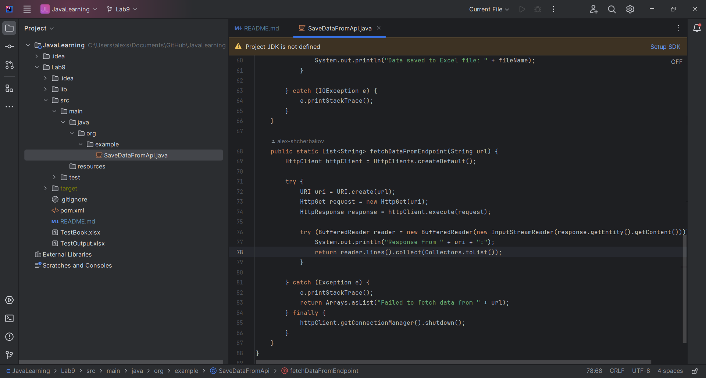
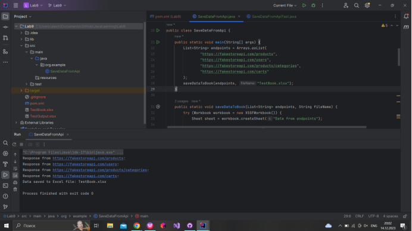
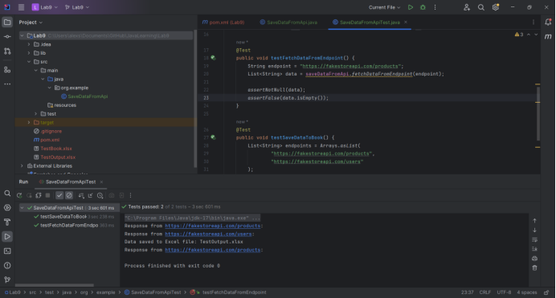

# JavaLearning
Лабораторна робота #9 Виконував: Щербаков Олексій ПД-34 Завдання: Завдання:

Використовуючи зазначене API ((рекомендовано http://api.recrm.ru/doc), https://fakestoreapi.com/,
https://fakeapi.platzi.com/en/rest/products/, aбо створіть самі https://mockoon.com/docs/latest/about/ з
https://mockoon.com/mock-samples/category/ecommerce/ темплейтами), отримати дані зі всіх енпоінтів.
Збережіть отримані дані у форматі Excel.
Покривайте код jUnit/Moskito тестами.

Хід розробки : Для виконання цієї роботи було обране API - https://fakestoreapi.com/ , тому що рекомендоване API 
знаходиться на російському домені і працювати з ним без VPN досить проблематично.
Для виконання основної задачі був створений клас SaveDataFromApi з двома методами для виконання завдань.
Метод fetchDataFromEndpoint отримує дані з нашого API:

Вміст відповіді отримується через потік , забезпечується конвертація його у список рядків (List<String>).
У випадку, якщо виникає яка-небудь помилка під час виконання запиту або обробки відповіді, вона логується,
і метод повертає список із повідомленням про невдачу.І в блоці finally, незалежно від того, чи була отримана
відповідь чи виникла помилка, з'єднання з URL закривається.

Метод saveDataToBook отримує дані з методу fetchDataFromEndpoint і створює ексель таблицю, в яку записує дані.

Створюється новий об'єкт Workbook типу XSSFWorkbook.Створюється рядок заголовків для кожного ендпоінту.
Кожен заголовок містить назву ендпоінту зі списку endpoints.Для всіх даних, отриманих за допомогою 
методу fetchDataFromEndpoint, дані записуються у відповідні стовпці в Excel-аркуші.
Кожен рядок даних представляється окремим рядком в Excel.Здійснюється збереження усіх зібраних даних у файл Excel
з вказаним ім'ям fileName.
Всі винятки типу IOException, які можуть виникнути під час збереження даних у файл, обробляються та їх стек
виводиться у консоль за допомогою e.printStackTrace().

Для покриття коду тестами був створений клас SaveDataFromApiTest з методом setUp, який виконується перед кожним 
тестом і два тести: testFetchDataFromEndpoint i testSaveDataToBook.

