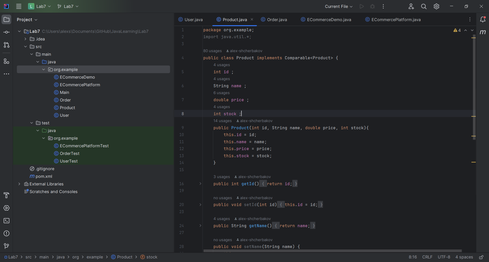
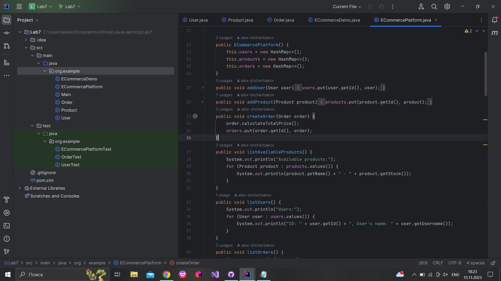

# JavaLearning
Лабораторна робота #1
Виконував: Щербаков Олексій ПД-34
Завдання:
1. Розробіть програму мовою Java для керування простою бібліотекою. У бібліотеці є книги, і кожна книга має такі властивості:

Назва
Автор
Номер ISBN
Рік видання

2. Покрити тестами функціональність програми.

Очікувана функціональність програми(Ваша програма повинна вміти):
-Додавати нову книгу в бібліотеку.
-Показувати всі книги в бібліотеці.
-Шукайти книгу за її назвою.
-Видаляти книгу з бібліотеки за її номером ISBN.

Хід розробки:
Виходячи з даного завдання було вирішено створити два класи - Book i Library.

В класі Book створили властивості title, author, isbn, year.
В класі Library створили ліст books, в який в майбутньому будуть додаватися книги.Далі реалізували методи для керування бібліотекою:
addBook - для додавання нової книги в список books.
showAllBooks - виведення в консоль інформації про всі книги, якщо вони є.
findBookByTitle - пошук книги за назвою.
removeBookByIsbn - видалення книги з списку за її Isbn кодом.

Після цього в  класі Main цей функціонал 
був використаний для створення основної програми.За допомогою циклу for і методів scanner.nextLine() і scanner.nextInt()
кількість книг для додавання регулюється в консолі під час виконання програми.

Також були додані умовні оператори if для випадків, коли не вдається знайти книгу за її назвою, або ж список вже пустий.

Нарешті, для класу Library були створені примітивні тести для перевірки коректної реалізації програми.
Данні тести були створені за допомогою фреймворку Junit для класу Library в якому знаходиться майже вся функціональність 
програми.Ми створюємо екземпляр класу Library перед кожним тестом за допомогою позначення @BeforeEach і методу setUp.
Після цього створюємо тести для різних функцій:
testAddBook - перевірка на коректну роботу метода AddBook.
testFindBookByTitle - перевірка на коректну роботу метода FindBookByTitle.
testRemoveBookByIsbn - перевірка на коректну роботу метода RemoveBookByIsbn.
testRemoveTwoBooks - теж перевірка на коректну роботу метода RemoveBookByIsbn, але вже для двох книг.
Перші два тести перевіряються за допомогою методу assertEquals, testRemoveBookByIsbn перевіряється за допомогою
assertNull і testRemoveTwoBooks за допомогою assertNotEquals.
